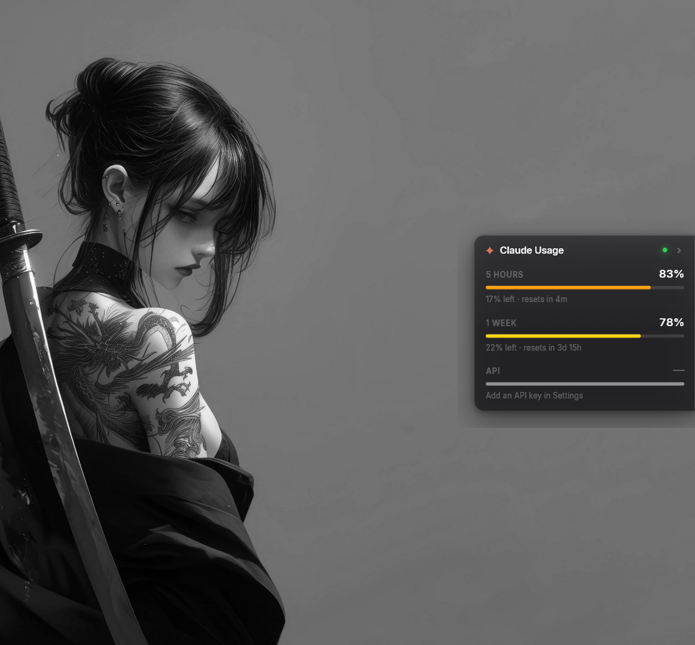
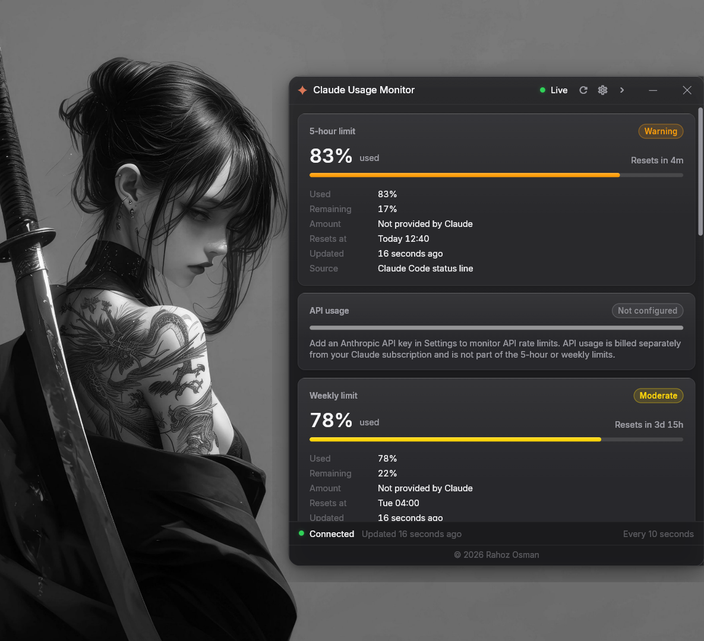
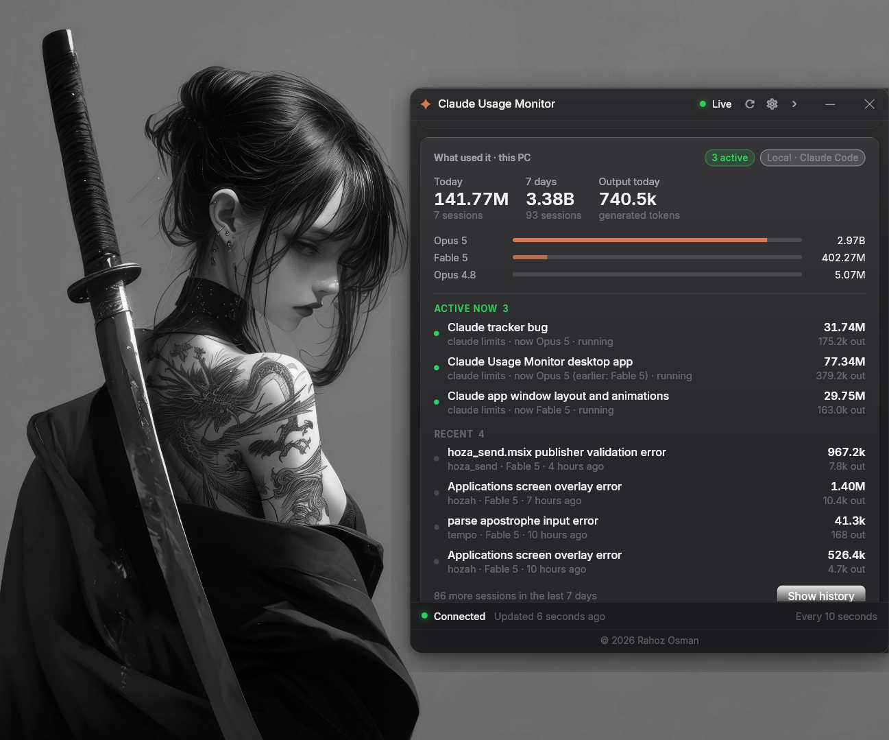
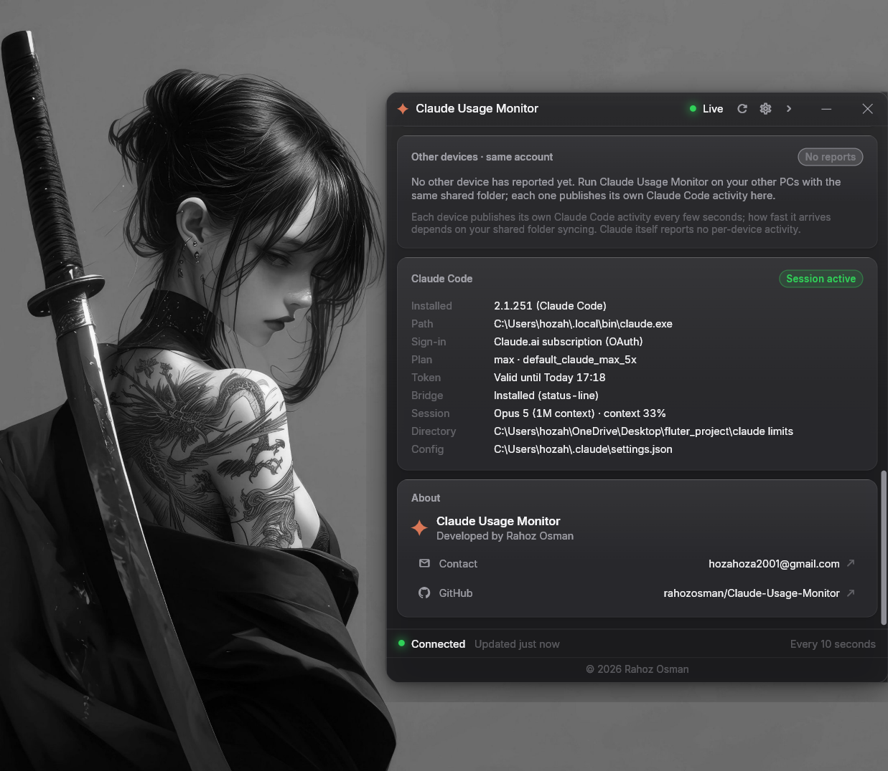
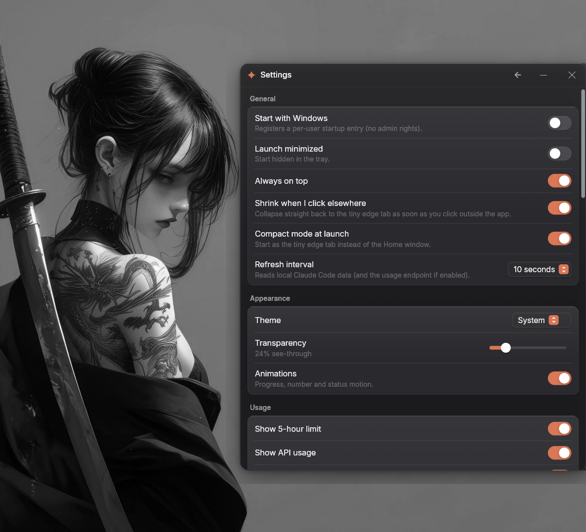
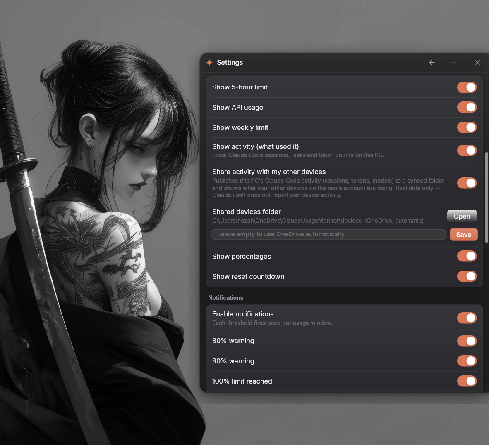

# Claude Usage Monitor

A small desktop utility for **Windows and macOS** that lives on the **right edge of your screen** and tells you how much of
your Claude usage is left — the 5‑hour window, the weekly window, API rate‑limit headroom, reset
countdowns and connection state — without opening Claude Code or a browser.

It starts as a sliver you can ignore, and opens into a full dashboard when you want the detail.


**Nothing is estimated or faked.** Every number comes from an official Anthropic surface, or the UI says
*Unavailable* / *Not provided by Claude* and explains why. See
[CLAUDE_USAGE_DATA.md](CLAUDE_USAGE_DATA.md) for the provenance of every value on screen.

---

## The three states

The monitor is one piece of glass attached to the right edge, and it has exactly three sizes. Each click
grows it; clicking anywhere outside shrinks it straight back to the sliver.

**1 · Edge tab** — a 20 × 76 px vertical sliver: the Claude mark and one hair‑thin level for whichever
window is tightest. Drag it up or down the edge; it always snaps back flush to the border and never ends
up floating in the middle of the screen.

**2 · Limits panel** — click the tab and the glass expands leftward into a compact panel with only the
three numbers that matter: **5 hours**, **1 week** and **API**, each with used %, remaining and a reset
countdown.



**3 · Home** — click again and it morphs into the full window: limits, local activity, other devices,
Claude Code status and Settings. ─ collapses back to the edge tab, × closes.

Clicking outside collapses it to the tab, never to Home. Turn that off in
Settings → General → *Shrink when I click elsewhere*.

**Only ever one copy runs.** The app claims an OS‑level lock at startup — a named mutex on Windows, an
exclusive file lock on macOS — so launching it again from Finder or Explorer, from the launcher, from the
login item, or from the Claude Code hook brings the running copy forward instead of adding a second icon.

---

## Limits at a glance

The top of Home carries the windows that decide when Claude stops answering: the **5‑hour limit**, **API
usage**, and the **weekly limit** — each with used and remaining percentages, when it resets, when it was
last updated, and which source it came from.



Warning thresholds are the app's own presentation, not Claude's:
0–60 % Normal · 60–80 % Moderate · 80–90 % Warning · 90–100 % Critical.

---

## What used it, on this PC

Percentages tell you *how much* is gone. This card tells you *what spent it* — read straight from the
Claude Code transcripts on your machine, the same basis as Claude Code's own `/usage` breakdown.



- **Today / 7 days / output today**, with session counts
- **Per‑model comparison** — each model's share of the week's tokens on one scale, so you can see at a
  glance where the tokens actually went
- **Per session (task)** — title, project, the model answering right now, tokens in and out, and whether
  it is still running, split into *Active now*, *Recent* and a *History* view for the last 7 days

Tokens do not map 1:1 to the limit percentages above, and this covers this PC only — claude.ai and other
machines are not included.

---

## How you use it, over time

The same numbers Claude Code shows in `/usage` → **Overview**, read straight from its own stats cache
(`~/.claude/stats-cache.json`) — with the days it has not finished counting filled in from the
transcripts, exactly as `/usage` does, so the card never sits several sessions behind the CLI.

- **All time / 30 days / 7 days**, with everything below recomputed for the range you pick
- **A contribution heatmap** — one cell per day, shaded by how busy it was; hover for that day's
  messages, sessions and tokens. A short history is drawn as a row of days rather than an empty year
- **Total tokens and sessions**, then six facts: favourite model and its share, longest session,
  active days, longest streak, current streak and your most active day
- **Input · output · cache read · cache write** as one bar with exact numbers — cache read is
  typically ~98 % of the total, and the bar shows that rather than hiding it
- **When you work** — sessions by the hour they started, a histogram Claude Code keeps but never shows

Every figure is one Claude Code wrote, or one counted from the same transcripts it counts. Where a
figure cannot be had honestly for a range, the card says why instead of interpolating one.

---

## Other devices, Claude Code status, and About

If you run Claude Code on more than one machine — including a Windows PC and a Mac — each copy of the
monitor can publish its own activity to a shared folder (OneDrive by default, iCloud Drive as a macOS
fallback) and show what the others are doing. Below it, the **Claude Code**
card reports what the app detected locally — version, path, sign‑in type, plan, token validity, whether
the bridge is installed, and the live session's model and context use.



Claude itself reports no per‑device activity, so every number in *Other devices* comes from that device's
own transcripts — nothing is inferred.

---

## Settings



- **General** — start at login (a per‑user registry entry on Windows, a login item on macOS; no admin
  rights either way), launch minimized, always on top, shrink on outside click, compact mode at launch,
  refresh interval (10 s / 30 s / 1 m / 5 m / manual)
- **Appearance** — Dark / Light / System theme, transparency, animation toggle

Further down: which cards to show, multi‑device sharing and its shared folder, and notifications.



System notifications fire at **80 %**, **90 %** and **100 %**, and on reset — each once per usage window,
so a long session cannot spam you.

---

## Download a build

You do not need a Mac to get the Mac app. Every push builds the app on real
Windows **and** macOS machines through GitHub Actions:

- **A one-off build** — *Actions* tab → *Build* → **Run workflow**. When it finishes, the
  `Claude-Usage-Monitor-macOS` and `Claude-Usage-Monitor-Windows` zips are attached to that run.
- **A release** — push a tag and the same two zips are attached to a GitHub Release:

  ```sh
  git tag v1.0.0
  git push origin v1.0.0
  ```

### Opening the macOS build the first time

The Mac app is **ad-hoc signed**, not signed with a paid Apple Developer ID, so macOS quarantines it
after download and will claim it is damaged. Clear that once:

```sh
xattr -dr com.apple.quarantine "claude_usage_monitor.app"
```

… or right-click the app → **Open** → **Open**. After that it launches normally. Signing it properly
needs an Apple Developer account; nothing in the code has to change for that.

---

## Quick start

**Windows** — double‑click **`Claude Usage Monitor.cmd`** in this folder.
**macOS** — double‑click **`Claude Usage Monitor.command`** (once, first:
`chmod +x "Claude Usage Monitor.command"`).

Both give you the same menu:

```
  [1] Turn ON   – start the monitor (builds it first if needed)
  [2] Turn OFF  – stop the monitor
  [3] Rebuild   – rebuild after code changes, then start
```

The first *Turn ON* builds the app (a few minutes; needs Flutter and the platform's C++/Xcode tools).
Later starts are instant. You can also run the built app directly:
`build\windows\x64\runner\Release\claude_usage_monitor.exe` on Windows, or
`build/macos/Build/Products/Release/claude_usage_monitor.app` on macOS.

*Turn OFF* and *Rebuild* ask the app to shut down cleanly so it removes its own tray icon — a forced kill
is what strands dead icons in the notification area.

---

## Where the numbers come from

| Section | Values | Source |
| --- | --- | --- |
| **5‑hour limit** | used %, remaining %, reset countdown, reset time, status | Claude Code status line (official) or the opt‑in usage endpoint |
| **Weekly limit** | used %, remaining %, reset countdown, reset time, status | same as above |
| **Extra windows** | e.g. *Weekly · Opus* when the source provides them | same as above |
| **API usage** | requests / input / output / total tokens remaining vs limit, replenish time, retry‑after, HTTP status | `anthropic-ratelimit-*` response headers (official) |
| **API · last 7 days** | input/output/cached tokens, cost, configured RPM/ITPM/OTPM | Admin Usage, Cost & Rate Limits APIs (official, Admin key) |
| **What used it** | today / 7‑day tokens, per‑model share, per‑session tokens with title, project, model, active state | local Claude Code transcripts on this PC |
| **Other devices** | per device: sessions open now, each session's model, tokens and output, today/7‑day totals, last update | each device publishes its own activity to a shared folder (opt‑in) |
| **Claude Code** | installed, version, path, sign‑in type, plan, tier, token validity, bridge, active session | local CLI + config metadata |
| **Status** | Live / Stale / Offline / Sign‑in needed / Not configured, "Updated N ago" | derived |

### Subscription limits (Pro / Max / Team / Enterprise)

Claude Code is the only official place that exposes the 5‑hour and weekly windows. Two ways in:

1. **Status‑line bridge (recommended, official).** The app writes a small script — PowerShell on Windows,
   `sh` on macOS — and points `statusLine.command` in `~/.claude/settings.json` at it. Claude Code then hands the app its documented
   `rate_limits` JSON after every response.

   This is **installed automatically the first time you open the app**, so there is nothing to set up —
   your `settings.json` is backed up first, and any status line you already had keeps working because its
   output is forwarded through. The automatic install is attempted once and recorded, so if you remove the
   bridge on purpose it stays removed; it is skipped entirely if Claude Code has never run on the machine.
   You can install or remove it by hand at any time in Settings → Claude Code.

   It needs an open Claude Code session to update; the app marks data *Stale* after 10 minutes.

2. **Usage endpoint (opt‑in, undocumented).** Settings → Claude Code → *Use Claude usage endpoint*. Calls
   the endpoint Claude Code's own `/usage` uses, with your local sign‑in token. Works without an open
   session, but it is not publicly documented and may change. Throttled to once per minute.

### API rate limits (Console / API key users)

Settings → API → paste an Anthropic API key (kept in Windows‑encrypted secure storage, or set
`ANTHROPIC_API_KEY` in your environment). On each probe the app sends one **1‑token** Messages request and
reads the official rate‑limit headers. Optionally add an Admin key (`ANTHROPIC_ADMIN_KEY`) for 7‑day
token/cost totals and your configured limits.

API usage is billed separately from your Claude subscription and is **not** part of the 5‑hour or weekly
limits. Leave it unconfigured if you only care about subscription limits — the card will simply say so.

### Opening and closing with Claude Code

Both on by default (Settings → Claude Code), so the monitor is running exactly when you are.

**Open with Claude Code** — the app adds one `SessionStart` hook to `~/.claude/settings.json` that starts
the monitor as the edge tab whenever a Claude Code session starts or resumes. If it is already running,
the hook just brings it forward instead of starting a second copy.

**Close with Claude Code** — when the last Claude Code session closes, the monitor quits itself, removing
its tray icon on the way out. It watches for the CLI process rather than relying on a `SessionEnd` hook,
because a hook never runs when a terminal window is killed outright. Two safeguards keep it from
disappearing unexpectedly: it never quits until it has actually seen a session running, so opening the
monitor on its own is not immediately undone; and it waits for two consecutive empty checks, so closing
one session and starting another does not count as "all gone". If the process check itself fails, it
assumes a session is still open and stays up.

Turn either off in Settings → Claude Code to run the monitor independently.

---

## Requirements

- Windows 10 / 11, or macOS 10.15+
- To build on Windows: Flutter 3.44+ (stable) with Windows desktop support, and Visual Studio with the
  **Desktop development with C++** workload
- To build on macOS: Flutter 3.44+ (stable) with macOS desktop support, and Xcode with its command‑line tools
- Optional: Claude Code (`claude`) signed in with a Claude.ai subscription; an Anthropic API key

## Building

```powershell
# Windows
flutter pub get
flutter build windows --release
# output: build\windows\x64\runner\Release\claude_usage_monitor.exe
# keep the accompanying data\ folder and DLLs beside it
```

```sh
# macOS
flutter pub get
flutter build macos --release
# output: build/macos/Build/Products/Release/claude_usage_monitor.app
```

### One codebase, two platforms

The Dart is shared; only the places that must differ do. Windows keeps exactly the behaviour it always
had, and macOS gets the equivalent:

| | Windows | macOS |
| --- | --- | --- |
| App data | `%LOCALAPPDATA%\ClaudeUsageMonitor` | `~/Library/Application Support/ClaudeUsageMonitor` |
| Bridge / hook scripts | PowerShell (`.ps1`) | POSIX `sh` (`.sh`) |
| Single instance | named kernel mutex | exclusive lock on `instance.lock` |
| Process checks | `tasklist` | `ps` |
| Tray icon | `.ico` beside the exe | `.png` inside the `.app` bundle |
| Launch at login | per‑user Run key | login item pointing at the `.app` |
| Stays out of the way | `skipTaskbar` | `LSUIElement` (no Dock icon) |
| Shared devices folder | OneDrive from the environment | `~/Library/CloudStorage/OneDrive…`, else iCloud Drive |

The macOS build runs **outside the App Sandbox on purpose** — it has to read Claude Code's own
`~/.claude` files and write the status‑line bridge back into them, which a sandboxed app cannot do
without the user hand‑picking every path. See `macos/Runner/Release.entitlements`.

## Privacy

Your API keys live in the OS credential store — Windows‑encrypted secure storage, or the macOS Keychain —
and are never written to preferences, logs or source. The only file the app writes outside its own folder is `~/.claude/settings.json` — always backed
up first, never touched if it fails to parse. Nothing is uploaded anywhere: the multi‑device feature
writes to a folder you choose and nothing else. See [SECURITY.md](SECURITY.md).

## Documentation

- [ARCHITECTURE.md](ARCHITECTURE.md) — layers, data flow, refresh model
- [CLAUDE_USAGE_DATA.md](CLAUDE_USAGE_DATA.md) — where every value comes from, and what is unavailable
- [SECURITY.md](SECURITY.md) — credential handling and what the app reads and writes
- [DEVELOPMENT.md](DEVELOPMENT.md) — project layout, running, adding a data source
- [TROUBLESHOOTING.md](TROUBLESHOOTING.md) — common problems and fixes

## Author

**Rahoz Osman**

- Contact — [hozahoza2001@gmail.com](mailto:hozahoza2001@gmail.com)
- GitHub — [rahozosman/Claude-Usage-Monitor](https://github.com/rahozosman/Claude-Usage-Monitor)

## License

© 2026 Rahoz Osman. No warranty. Not affiliated with Anthropic.
